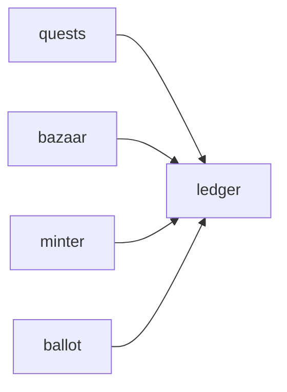

# Ledger

**Economy Ledger** — A planned transaction service for tracking pet-economy assets with double-entry postings.

Part of [ComputerPets](https://github.com/RicheyWorks/computerpets). Map: [computerpets-ecosystem](https://github.com/RicheyWorks/computerpets-ecosystem).

[Status](#status) · [Contract](docs/CONTRACT.md) · [Contributor start](#contributor-start) · [Ecosystem](https://github.com/RicheyWorks/computerpets-ecosystem)

| Project | At a glance |
| --- | --- |
| Status | Design scaffold; not runnable yet |
| License | MIT |
| First pet | [Flagship start guide](https://github.com/RicheyWorks/computerpets/blob/main/docs/START-HERE.md) |

## Status

This repository contains a [contract](docs/CONTRACT.md) and a [source placeholder](src/main/java/com/enterprisepet/ledger/package-info.java). It has no runnable application, build manifest, automated tests, or CI workflow.

The experience, interfaces, integrations, and safeguards below are **implementation plans**, not supported features. The first implementation slice defines the initial contribution target.

## Planned role

Treats, coins, and wei cannot drift. Ledger is the book: every quest reward, bazaar fill, and mint fee is a pair of postings.

For the desktop pet, start with the [flagship guide](https://github.com/RicheyWorks/computerpets/blob/main/docs/START-HERE.md).

## Intended audience

Minter, Bazaar, Quests, Ballot. If value moves, it posts here.

## Out of scope

Not an exchange. Not a place to delete history.

## Proposed integration



## Planned stack

Java 21 · Spring Boot 3.3 · double-entry tables · Flyway · PostgreSQL · optional chain settlement

GroupId / namespace: `com.enterprisepet.ledger`  
Proposed listen surface: `8086`

## Proposed contract

### Data

`Account(id, asset, owner) · Posting(debit, credit, amount, ref) · Asset(COIN|TREAT|WEI|VOTE)`

### Surface

- POST /v1/post — {debit, credit, amount, ref} — atomic
- GET /v1/accounts/{id} — balances by asset
- GET /v1/audit/{ref} — both sides of a business event

### Planned safeguards

Unbalanced post → reject. Partial chain settlement → hold in escrow account, never delete the row. Replay → unique(ref) constraint.

## First implementation slice

Initial implementation target:

**Double-entry `post` with unique `ref`. Assets: COIN, TREAT, WEI, VOTE.**

Acceptance targets: Unbalanced post rejected. Replay of same ref is a no-op. Chain settlement sits in escrow until confirms.

## Planned environment

`DATABASE_URL`

Never commit secrets. Never put Steam or chain keys in the overlay.

## Related projects

- [computerpets-minter](https://github.com/RicheyWorks/computerpets-minter)
- [computerpets-bazaar](https://github.com/RicheyWorks/computerpets-bazaar)
- [computerpets-quests](https://github.com/RicheyWorks/computerpets-quests)
- [computerpets-console](https://github.com/RicheyWorks/computerpets-console)
- [computerpets-ballot](https://github.com/RicheyWorks/computerpets-ballot)

## Layout

```
computerpets-ledger/
  README.md           this file
  LICENSE             MIT
  docs/CONTRACT.md    the same contract, frozen for implementers
  src/                implementation lands here
```

## Contributor start

With Git and PowerShell, clone the scaffold and read its contract and source marker:

```powershell
git clone https://github.com/RicheyWorks/computerpets-ledger.git
Set-Location computerpets-ledger
Get-Content .\docs\CONTRACT.md
Get-Content .\src\main\java\com\enterprisepet\ledger\package-info.java
```

Start with the [first implementation slice](#first-implementation-slice). Add the minimum project setup and tests needed for that slice, then document verified run commands. The proposed stack above is a design choice; there is no install or launch command for this checkout yet.

## Links

- Flagship: [RicheyWorks/computerpets](https://github.com/RicheyWorks/computerpets)
- This repo: [RicheyWorks/computerpets-ledger](https://github.com/RicheyWorks/computerpets-ledger)
- Map: [RicheyWorks/computerpets-ecosystem](https://github.com/RicheyWorks/computerpets-ecosystem)
- Contract file: [docs/CONTRACT.md](docs/CONTRACT.md)

## License

MIT. See [LICENSE](LICENSE).

---

*Two hundred ten living kinds. Keep them so a line does not go quiet.*
