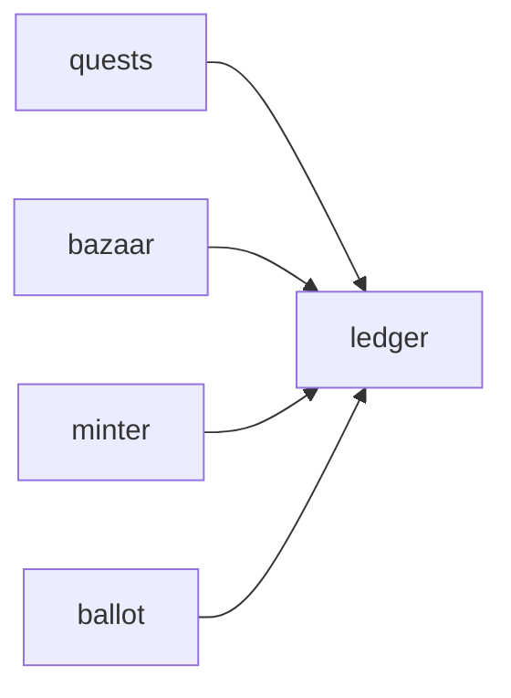

# Ledger

**Economy Ledger** — Transaction service balancing in-game currency against crypto assets.

Part of [ComputerPets](https://github.com/RicheyWorks/computerpets). Map: [computerpets-ecosystem](https://github.com/RicheyWorks/computerpets-ecosystem).

| | |
| --- | --- |
| Status | Design scaffold — contract frozen, implementation next |
| License | MIT |
| First pet | Still [Rui on the desktop](https://github.com/RicheyWorks/computerpets/blob/main/docs/START-HERE.md). This organ is optional. |

## The job

Treats, coins, and wei cannot drift. Ledger is the book: every quest reward, bazaar fill, and mint fee is a pair of postings.

The flagship overlay already puts a living sticker on the real desktop (Rui first, 210 kinds). Ledger does not replace that. It is one organ.

## Who uses it

Minter, Bazaar, Quests, Ballot. If value moves, it posts here.

## What it is not

Not an exchange. Not a place to delete history.

## Architecture



## Stack

Java 21 · Spring Boot 3.3 · double-entry tables · Flyway · PostgreSQL · optional chain settlement

GroupId / namespace: `com.enterprisepet.ledger`  
Default listen: `8086`

## Contract

### Data

`Account(id, asset, owner) · Posting(debit, credit, amount, ref) · Asset(COIN|TREAT|WEI|VOTE)`

### Surface

- POST /v1/post — {debit, credit, amount, ref} — atomic
- GET /v1/accounts/{id} — balances by asset
- GET /v1/audit/{ref} — both sides of a business event

### Failure doctrine

Unbalanced post → reject. Partial chain settlement → hold in escrow account, never delete the row. Replay → unique(ref) constraint.

## First slice

Build this and stop. Do not boil the ocean.

**Double-entry `post` with unique `ref`. Assets: COIN, TREAT, WEI, VOTE.**

You know it works when: Unbalanced post rejected. Replay of same ref is a no-op. Chain settlement sits in escrow until confirms.

## Environment

`DATABASE_URL`

Never commit secrets. Never put Steam or chain keys in the overlay.

## Neighbors

- computerpets-minter
- computerpets-bazaar
- computerpets-quests
- computerpets-console
- computerpets-ballot

## Layout

```
computerpets-ledger/
  README.md           this file
  LICENSE             MIT
  docs/CONTRACT.md    the same contract, frozen for implementers
  src/                implementation lands here
```

## Run (Windows)

PowerShell, from this folder, after the flagship helpers (Git, Node LTS 22+, JDK 21 as needed):

```powershell
mvn -q -DskipTests package; java -jar target/ledger-1.0.0-SNAPSHOT.jar
```

You do not need this service to meet Rui. The [flagship start-here](https://github.com/RicheyWorks/computerpets/blob/main/docs/START-HERE.md) is still the first pet.

## Links

- Flagship: [RicheyWorks/computerpets](https://github.com/RicheyWorks/computerpets)
- This repo: [RicheyWorks/computerpets-ledger](https://github.com/RicheyWorks/computerpets-ledger)
- Map: [RicheyWorks/computerpets-ecosystem](https://github.com/RicheyWorks/computerpets-ecosystem)
- Contract file: [docs/CONTRACT.md](docs/CONTRACT.md)

## License

MIT. See [LICENSE](LICENSE).

---

*Two hundred ten living kinds. Keep them so a line does not go quiet.*
